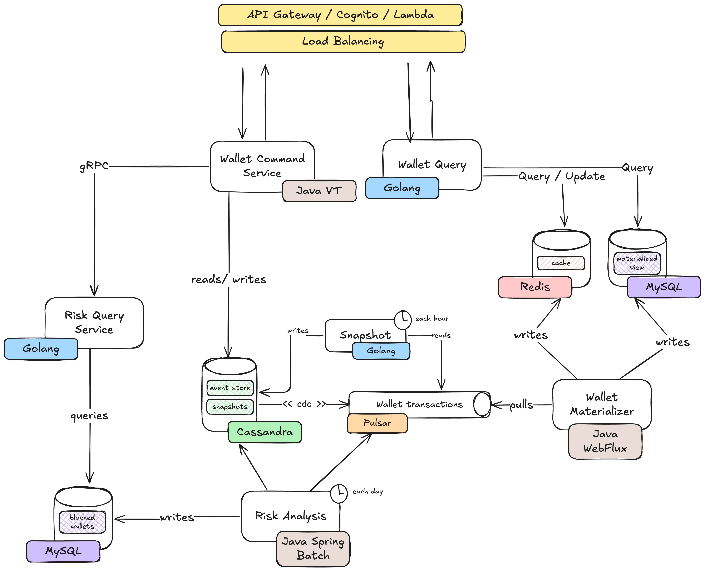

# 🏦 Wallet System Overview

Este projeto implementa um sistema de carteira digital com arquitetura baseada em **CQRS + Event Sourcing**, separando responsabilidades entre **Write Side** (comandos, validações, persistência) e **Read Side** (consultas e views materializadas).

## 📂 Arquitetura

---

## 🧱 Infraestrutura

- **MySQL (risks-db)**: Armazena análise de risco e metadados
- **MySQL (risks-db)**: Armazena a materialized view no read side
- **Cassandra (events-db)**: Event store e snapshots de saldo.
- **Apache Pulsar**: Broker de eventos pub/sub entre serviços.
- **Redis (wallets-cache)**: Cache da materialized view, além de lock distribuído para operações concorrentes nas carteiras.

---

## ✍️ Write Side (Caminho de Escrita)

- **Wallet Command Service**

  - _Linguagem:_ Java 21
  - _Stack:_ Spring Web com Virtual Threads
  - _Função:_ API REST para depósitos e saques. Aplica locking com Redis.

- **Risk Query Service**

  - _Linguagem:_ Go
  - _Stack:_ gRPC
  - _Função:_ Avaliação de risco em tempo real durante operações.

- **Snapshot Routine Service**

  - _Linguagem:_ Go
  - _Stack:_ Cron job
  - _Função:_ Gera snapshots periódicos de saldo no Cassandra.

- **Risk Analysis Service**
  - _Linguagem:_ Java 21
  - _Stack:_ Spring Batch
  - _Função:_ Job offline para análise de risco e fraude. Persiste dados no MySQL.

---

## 📖 Read Side (Caminho de Leitura)

- **Wallet Materializer Service**

  - _Linguagem:_ Java 21
  - _Stack:_ Spring WebFlux
  - _Função:_ Consumidor de eventos do Pulsar para atualizar views no NoSQL.

- **Wallet Query**
  - _Linguagem:_ Go
  - _Stack:_ REST API
  - _Função:_ Expõe o estado da carteira (saldo, histórico) baseado na view materializada.

---
